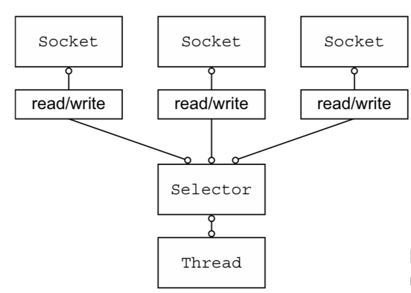
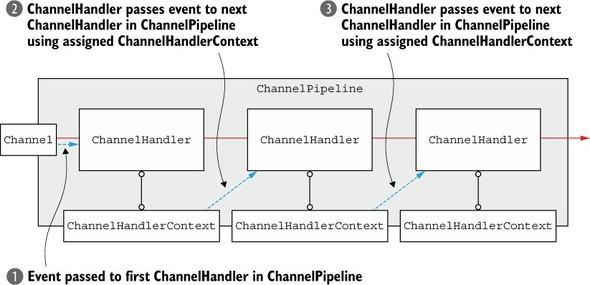

# Intro
Netty가 생겨나게 된 배경 ⚪

## 목차
- [Intro](#intro)
  - [목차](#목차)
  - [Blocking I/O](#blocking-io)
  - [Non-Blocking I/O](#non-blocking-io)
  - [Netty 핵심 컴포넌트](#netty-핵심-컴포넌트)
    - [Channel](#channel)
    - [CallBack](#callback)
    - [Future](#future)
    - [이벤트와 핸들러](#이벤트와-핸들러)
  - [결론](#결론)

## Blocking I/O

한번 `TCP` 의 경우를 예를 두고 생각해볼까.?  

```java
ServerSocket serverSocket = new ServerSocket(port);
Socket clientSocket = serverSocket.accpet(); // blocking
// stream 객체 선언 생략
String request, response;
while ((request = in.readLine()) != null) {
    if ("Done".equals(request)) {
        break;
    }
    response = processRequest(request);
    out.println(response);
}
```
위 코드의 단점이 무엇일까?  
바로 위 코드는 **한 번에 한 연결만 처리하게 된다**    
Socket 하나당 읽고 쓰는 과정에 대한 thread가 하나씩 맡아서 해야된다는 의미다  
```text
만약 10,000개의 커넥션이 들어온다면?
```
쓰레드의 메모리 크기는 1MB 까지 차지할 수 있으므로.. 벌써 10GB? 🚫  

## Non-Blocking I/O

<div>
    
</div>

가장 중요한 핵심은 바로 `Selector` 라는 모듈에 의해서  
I/O에 대한 이벤트를 통지하는데에 있습니다  
그래서 적은 자원으로 여러 I/O를 능수능란하게 처리할 수 있게 되는 것이죠  
<br>
비동기성을 가지게 됨으로 최고 수준의 확장성을 실현할 수 있게 되는 것입니다
* 작업에 대한 완료를 기다리지 않고, 즉시 반환되며 작업에 대한 결과는 나중에 통보된다
* Selector가 적은 수의 쓰레드로 여러 Connection에서 이벤트를 모니터링한다

## Netty 핵심 컴포넌트

그래서 대표적인 java NIO 프레임워크가 `Netty` 인 것이다

### Channel

Channel은 다음과 같이 정의되어 있는데요
```text
하나 이상의 입출력 작업을 수행할 수 있는 하드웨어 장치, 파일, 소켓과 같은
엔티티에 대한 열린 연결
```

그리고 Channel은 **데이터가 들어오는 인바운드(Inbound)** ,
**데이터가 나가는 아웃바운드(Outbound)** 라는 개념이 존재합니다.

### CallBack

CallBack은 다른 메서드로 자신에 대한 참조를 제공하는 메서드  
어떤 특정한 이벤트가 트리거링 되면 수행되는 메서드라 보면 쉬워요!
```java
public class ConnectHandler extends ChannelInboundHandlerAdapter {
    @Override
    public void channelActive(ChannelHandlerContext ctx) throws Exception {
        System.out.println("Client" + ctx.channel().remoteAddress() + " Connected.");
    }
}
```

### Future

작업이 완료되면 이를 애플리케이션에 알리기 위한 방식  
`Netty`에는 **ChannelFuture** 를 사용하고 있다!  
```java
ChannelFuture future = channel.connect(new InetSocketAddress("localhost", 25));
```
위 코드 처럼 사용하면 커넥션이 연결되든 말든 다음 로직을 수행할 수 있다  


### 이벤트와 핸들러

<div>
    
</div>

`Netty`는 작업의 상태 변화를 알리기 위해 **이벤트**를 사용하며,  
발생한 이벤트를 **핸들러**를 통해 동작을 트리거링 할 수 있다  

## 결론

그래서 `Netty`는 EventLoop에 의해서 Channel의  
모든 I/O 이벤트를 처리하고 한 스레드에 의해서 제어된다  
1. 관심 이벤트 등록
2. 이벤트를 ChannelHandler로 발송
3. 추가 동작 스케줄링

에 대한 정의만 있다면, 누구든지 쉽게 사용할 수 있게 되는 것이다!