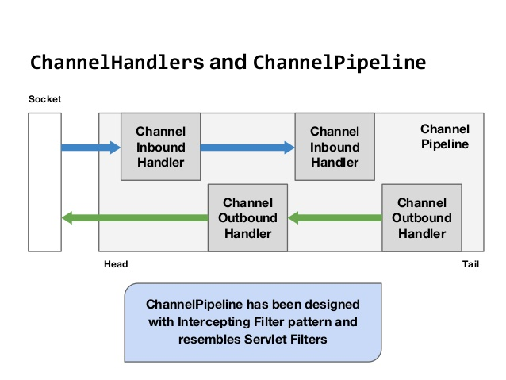
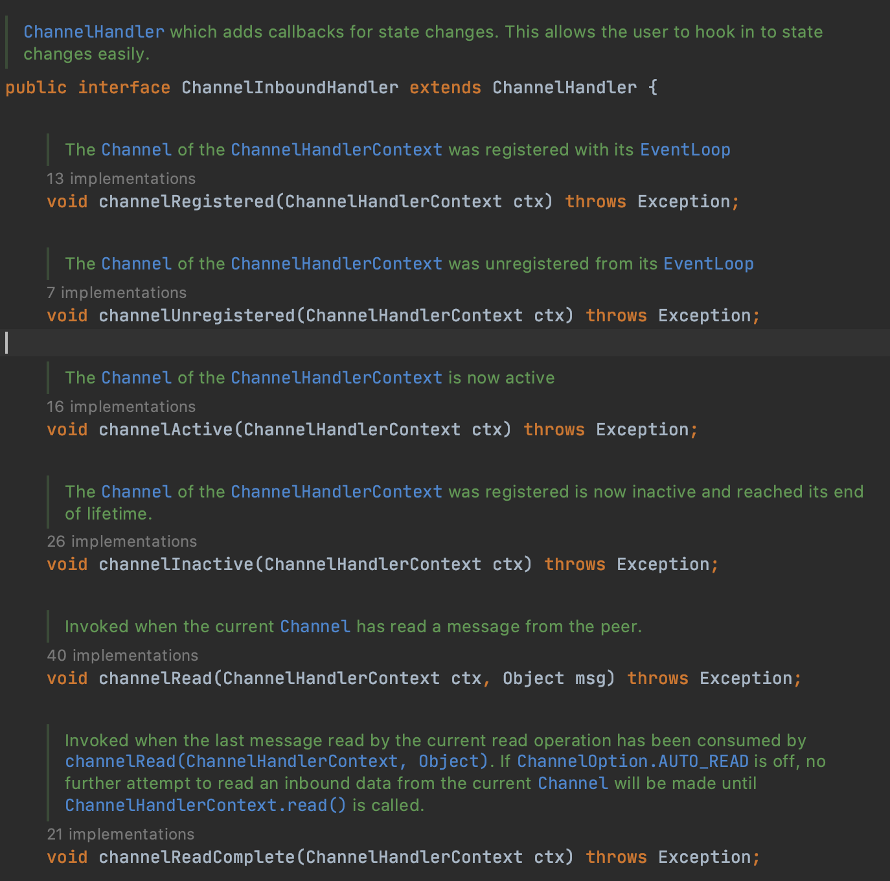
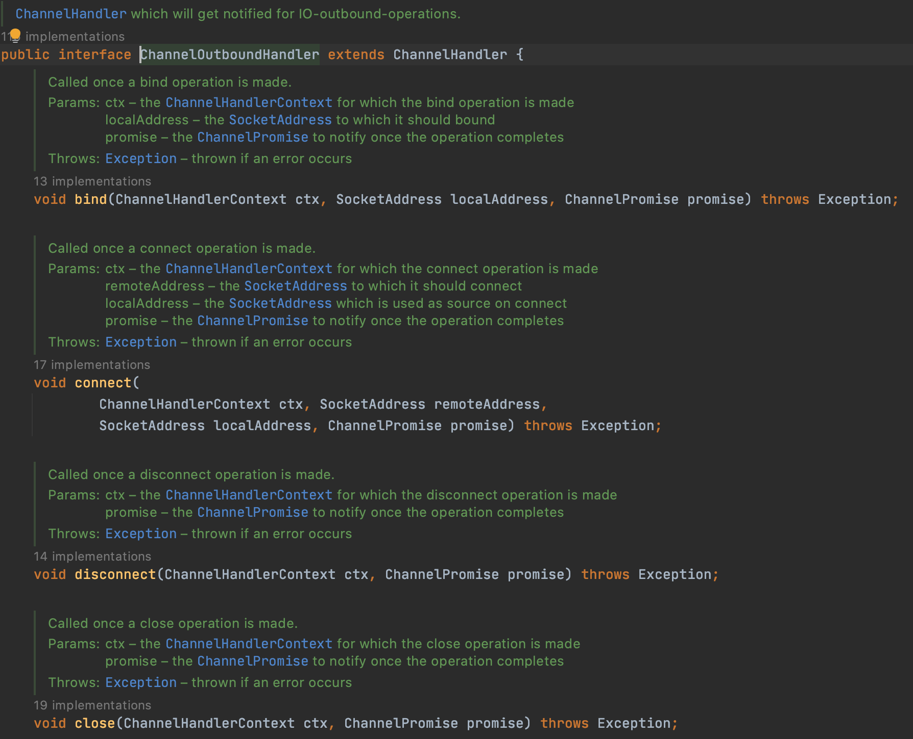

# Channel

데이터의 흐름을 관제하는 컴포넌트 🏳️  

## 목차
- [Channel](#channel)
  - [목차](#목차)
  - [Channel](#channel-1)
  - [ChannelHandler](#channelhandler)
    - [용도](#용도)
    - [생명주기](#생명주기)
    - [ChannelInboundHandler](#channelinboundhandler)
    - [ChannelOutboundHandler](#channeloutboundhandler)
  - [ChannelPipeline](#channelpipeline)
  - [ChannelHandlerContext](#channelhandlercontext)
  - [예외처리](#예외처리)


## Channel

기본적으로 `Netty`는 Channel에 대한 추상화된 인터페이스를 제공한다  

|메서드 이름|설명|
|---|---|
|eventLoop|Channel에 할당된 EventLoop을 반환|
|pipeline|Channel에 할당된 ChannelPipeline을 반환|
|isActive|Channel이 활성 상태일 때 true를 반환|
|localAddress|로컬 SocketAddress를 반환|
|remoteAddress|원격 SocketAddress를 반환|
|write|데이터를 원격 피어로 출력|
|flush|기반 전송으로 이전에 출력된 데이터를 플러시|
|writeAndFlush|write()와 flush()를 모두 호출|

또한 Channel은 각각 어떤 상태인지에 대한 관리도 필요한데,  
Channel은 그래서 각각의 상태들이 존재한다  


|상태|설명|
|---|---|
|ChannelUnregistered|Channel이 생성됐지만 EventLoop에 등록되지 않음|
|ChannelRegistered|Channel이 EventLoop에 등록됨|
|ChannelActive|Channel이 활성화됨|
|ChannelInactive|Channel이 원격 피어로 연결되지 않음|


이를 보통 `Selector` 가 담당하게 된다!  
선택 작업에 대한 비트 집합은 아래와 같다

|이름|설명|
|---|---|
|OP_ACCEPT|새로운 연결이 수락되고 Channel이 생성되면 알린다|
|OP_CONNECT|연결되면 알린다|
|OP_READ|Channel에서 데이터를 읽을 수 있으면 알린다|
|OP_WRITE|Channel로 데이터를 기록할 수 있으면 알린다(보통 소켓 버퍼가 완전히 차는 상황을 처리)|


## ChannelHandler

Netty는 일반적으로 `Channel` 단위로 비동기 처리가 이루어지는데,  
동작은 크게 2가지로 구분됩니다  
1. Inbound: 데이터가 들어오는 방향
2. Outbound: 데이터가 나가는 방향

<div>
  
</div>

Handler에서 보통 추상화된 메서드로는 

```java
void channelActive(ChannelHandlerContext ctx) throws Exception;
```

이런 메서드가 존재하는데, `ChannelHandlerContext` 를 이용해서  
이벤트를 현재 체인의 다음 핸들러로 전달할 수 있다  
<br>
보통 `ChannelHandler` 의 경우에는 다양한 종류가 있는데요,  
Netty는 **Application의 입장을 고려** 해서 조금 더 쉽게 개발할 수 있는  
`ChannelHandlerAdapter`를 제공하고 있습니다  
<br>
그래서 보통 Custom Adapter를 구현할 때는...

* ChannelHandlerAdapter
* ChannelInboundHandlerAdapter
* ChannelOutboundHandlerAdapter
* ChannelDuplexHandlerAdapter

위의 클래스들을 상속하여 사용하게 된다!

### 용도

그러면 `Handler`를 어떻게 사용해야 할까? 🧰    
보통은..
* 데이터를 한 포맷에서 다른 포맷으로 변환
* 예외에 대한 알림 제공
* Channel의 활성화 또는 비활성화에 대한 알림 제공
* Channel을 EventLoop에 등록할 때 알림 제공
* 사용자 정의 이벤트에 대한 알림 제공

개발자가 정의한 ChannelHandler를 사용할 때는 공통의 Handler를 만들고 재사용하는게 목적인데요,  

ChannelHandler를 공유하는 이유중의 대표적인 이유는 바로  
```text
여러 Channel 에서 통계 정보를 얻기 위해서다
```


### 생명주기

생명주기를 관리하는 수명주기 메서드들이 존재하는데요.! 📁    

|메서드|설명|
|---|---|
|handlerAdded|ChannelHandler가 ChannelPipeline에 추가할 때 호출함|
|handlerRemoved|ChannelHandler가 ChannelPipeline에서 제거될 때 호출됨|
|exceptionCaught|ChannelPipeline에서 처리 중에 오류가 발생하면 호출됨|

### ChannelInboundHandler

Data를 수신할 때의 Handler 인데요,  
전체적인 인터페이스는 다음과 같습니다.  

<div>
  
</div>

* ChannelRegistered : channel이 EventLoop에 등록되고 입출력을 처리할 수 있을 때
* ChannelUnregistered : channel이 EventLoop에 해제되고 입출력을 처리할 수 없을 때
* ChannelActive : Channel의 연결과 바인딩이 완료되었을 때
* ChannelInactive : Channel이 활성 상태에서 벗어나 로컬 피어에 대한 연결이 해제되었을 때
* ChannelRead : Channel에서 데이터를 읽을 때
* ChannelReadComplete : Channel에서 읽기 작업이 완료되었을 때


### ChannelOutboundHandler

Data를 송신할 때의 Handler

<div>
  
</div>

* bind : Channel을 Local 주소로 Bind 요청시 호출됨
* connect : Channel을 원격 피어로 연결시 호출됨
* disconnect : Channel을 원격 피어로부터 연결 해제 요청시 호출됨
* close : Channel을 닫는 요청시 호출됨
* 


## ChannelPipeline

그래서 이 Channel Pipeline은 위에서 언급한 `Handler` 들의  
체인을 위한 컨테이너를 제공하는 것이 목적이에요!  

1. ChannelInitializer 구현은 ServerBootStrap에 등록된다
2. initChannel()이 호출되면 Handler의 커스텀 집합을 파이프라인에 설치한다
3. ChannelInitializer는 ChannelPipeline에서 자신을 제거한다

보통은 그래서 ChannelPipeline은 `Intercepting Filter` 라는 공통 설계 패턴을 구현한다.  
이 패턴에서는 여러 명령이 체인으로 연결되고,  
한 명령의 출력이 다음 명령의 입력이 됩니다.  

## ChannelHandlerContext

`ChannelPipeline` 에는 pipeline을 통하는 `ChannelHandlerContext` 라는 개념이 존재하는데요

```text
ChannelHandlerContext는 해당 ChannelPipeline 및 다른 핸들러와
상호작용할 수 있게 됩니다.
```

* bind : 지정된 SocketAddress로 바인딩하고 ChannelFuture를 반환한다
* channel : 이 인스턴스로 바인딩된 Channel을 반환한다
* close : Channel을 닫고 `ChannelFuture`를 반환한다
* connect : 주어진 SocketAddress로 연결하고 ChannelFuture를 반환한다
* 기타 등등

이 `ChannelHandlerContext`를 사용할 때에는 주의사항이 있는데요,  
* ChannelHandler와 연결된 ChannelHandlerContext는 절대 변경되지 않으므로 참조를 저장해도 괜찮습니다
* 이벤트 흐름이 짧기 때문에, 잘 활용하면 성능상의 이점을 얻을 수 있다

```java
ChannelHandlerContext ctx = ..;
Channel channel = ctx.channel();
channel.write(Unpooled.copiedBuffer("Netty in Action", CharsetUtil.UTF_8));
```

그리고 `ChannelHandlerContext` 의 참조를 캐싱하는 전략도 있는데요

```java
public class WriteHandler extends ChannelHandlerAdapter {
    private ChannelHandlerContext ctx;

    @Override
    public void handlerAdded(ChannelHandlerContext ctx) throws Exception {
        this.ctx = ctx;
    }

    public void send(String msg) {
        ctx.writeAndFlush(msg);
    }
}
```

요렇게 다양한 용도로 활용할 수 있다!

## 예외처리

`Channel`에 대하여 예외 처리하는 것은 정말 중요한데요,  
Netty에서도 이러한 인터페이스를 제공하고 있습니다  

```java
@Override
public void exceptionCaught(ChannelHandlerContext ctx, Throwable cause) throws Exception {
  cause.printStackTrace();
  ctx.close();
}
```

가장 기본적인 예외처리며, stack trace를 표기하고 channel을 닫는 예외처리 방식입니다  
하지만 어떤 경우에는 Channel을 닫지 않을 수도 있고, 복구를 시도할 수 있으니 여러 전략들이 존재합니다!  

그래서 요약하면,
* ChannelHandler.exceptionCaught() 의 기본 구현은 현재 예외를 파이프라인의 다음 핸들러로 전달한다.
* 예외가 파이프라인의 끝에 도달하면 예외가 처리되지 않았음을 알리는 항목이 로깅된다.
* 예외가 처리되는 방식을 커스텀하려면 exceptionCaught()를 재정의하라

