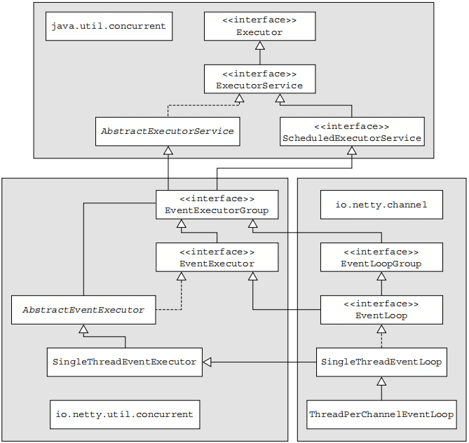
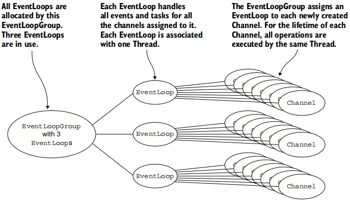

# EventLoop

네티의 스레딩 모델을 학습해보자 🤞  

## 목차
- [EventLoop](#eventloop)
  - [목차](#목차)
  - [등장하게 된 배경](#등장하게-된-배경)
  - [EventLoop 인터페이스](#eventloop-인터페이스)
  - [작업 스케줄링](#작업-스케줄링)
  - [구현 세부사항](#구현-세부사항)
    - [쓰레드 관리](#쓰레드-관리)
    - [EventLoop 관리](#eventloop-관리)
  - [결론](#결론)
  

## 등장하게 된 배경

보통 `Java` 진영에서의 **Executor** 라이브러리는 멀티쓰레딩에 적합한 표준 API를 제공하고 있다  
1. Runnable을 상속받은 객체로 작업을 정의
2. Executor가 쓰레드를 할당하여 작업을 실행
3. 작업이 끝나면 쓰레드를 반환

하지만 위와 같은 상황은 치명적인 단점이 존재하는데,  
`동시성` 을 위한 작업들이 늘어나게 된다면 쓰레드가 점점점 늘어나게 된다  

```text
작업이 10개라면 괜찮지만... 만약 100,000개라면? 쓰레드가 100,000개가 되어버린다 ㅠ
```

## EventLoop 인터페이스

그래서 이를 해결하고자 했던 방식이 `이벤트` 기반의 멀티쓰레딩 방식이다  
이벤트를 binding 하는 쓰레드는 1개로 고정하고, 작업을 실행하고 쓰레드를 관리하는 것은 다중으로 하는 방식이다  
<br>
따라서 작업의 속성에 따라 이 `EventLoop`를 1개로 할 것인지 여러 개로 할 것인지는 선택의 몫이다.!  

<div>
    
</div>


## 작업 스케줄링

일반적인 JDK 에서 제공하는 쓰레드 스케줄링 방식은

|메서드|설명|
|---|---|
|newScheduledThreadPoll(int corePoolSize)|명령을 지연 시가 후 또는 주기적으로 실행하도록 예약하는 쓰레드 스케줄링 팩터리 메서드|
|newSingleThreadScheduledExectuor|위와 똑같으나 싱글쓰레드 전용|

선택사항이 많지는 않지만, 해당 팩토리 메서드를 통해서 관리하는 객체를 만들 수 있다  
다만, 부하가 심한 상황에서는 성능저하가 빈번하게 발생한다  

그래서 이를 `EventLoop` 로 한다면?

```java
Channel ch = ...
ScheduledFuture<?> future = ch.eventLoop().schedule(
    new Runnable() {
        @Override
        public void run() {
            System.out.println("60 seconds later");
        }
    }, 60, TimeUnit.SECONDS);
```

## 구현 세부사항

네티의 쓰레딩 모델과 스케줄링 기법에 대해 조금 더 자세히 살펴보자

### 쓰레드 관리

`Netty`의 쓰레딩 모델이 탁월한 성능을 내는 이유는  
현재 실행중인 쓰레드의 **ID를 확인하는 기능**,  
다시 말해 **Thread가 현재 Channel과 해당 EventLoop에 할당된 것인지 확인하는 기능** 이 존재하기 때문이다!!  

<div>
    
</div>

1. EventLoop에서 실행될 작업이 있다면
2. 작업이 실행 메서드로 전달되고, 호출 쓰레드가 EventLoop에 할당된 쓰레드인지 검사하는 작업을 수행
3. 쓰레드가 동일한 경우 동일 EventLoop 이므로 바로 작업을 시행
4. 만일 아니라면, EventLoop가 이벤트를 처리할 때 작업을 실행하도록 queue에 예약

### EventLoop 관리

EventLoop도 마찬가지로 여러개가 될 수 있으니  
이를 관리하는 `EventLoopGroup`라는 객체도 존재한다.!  

<div>
    
</div>

* `EventLoopGroup`은 EventLoop들을 관리
* `EventLoop`은 할당된 모든 Channel의 이벤트와 작업을 처리
* `Channel`은 수명주기 동안 모든 작업이 동일한 Thread에 의해 실행됨

## 결론

이번장은 Java 동시성 프로그래밍과 쓰레드 풀에 대한 관리에 대한 내용이에요.!  
어려움이 있다면 더 찾아보면서 공부해야 될 것 같습니다 :) 