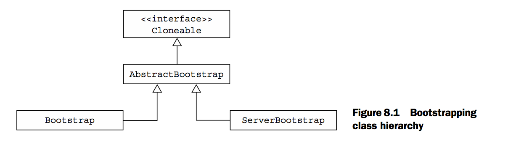
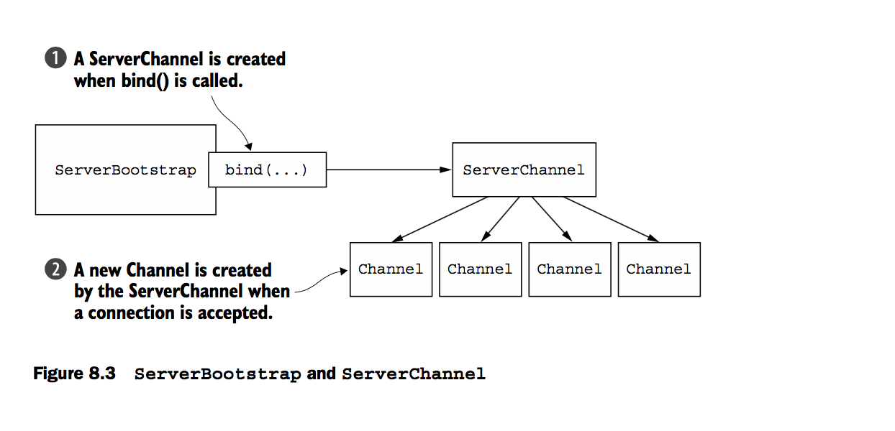
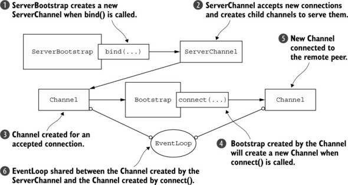

# BootStrap

지금까지 배웠던 모든 지식들을 통해 `Netty` 를 어플리케이션으로 만들어보자~!

## 목차
- [BootStrap](#bootstrap)
  - [목차](#목차)
  - [Class](#class)
    - [Bootstrap](#bootstrap-1)
    - [ServerBootstrap](#serverbootstrap)
    - [Client + ServerBootstrap](#client--serverbootstrap)
    - [Channel Initializer](#channel-initializer)
  - [Channel Option](#channel-option)
  - [종료](#종료)

## Class

<div>
  
</div>

크게 추상화된 `AbstractBootstrap`과 구체적인 계층인  
`Bootstrap` , `ServerBootstrap` 2가지가 존재하는데요  
<br>
간단히 생각해서.. `Bootstrap`는 Client의 역할(단일 채널 생성),  
`ServerBootStrap`는 Server의 역할(연결을 수락하고 통신하기 위해 다중 채널 생성)  
을 가지고 있다고 보면 될 것 같습니다 😄  


### Bootstrap

주로 연결을 위한 API들이 존재하며, 내용은 아래와 같아요
* Bootstrapgroup(EventLoopGroup) - channel의 모든 이벤트를 처리할 group
* localAddress(SocketAddress) - channel이 binding될 로컬 주소
* option(ChannelOption option, value) - channel config에 적용할 channeloption
* attr(Attribute key, value) - channel의 특성을 지정하는 것
* **ChannelFuture connect()** - 원격 피어에 연결하고 연결이 완료되면 알림을 받는 ChannelFuture를 반환
* **ChannelFuture bind()** - channel을 바인딩하고 완료되면 알림을 받는 Channel. 단 이 작업 이후에 connect를 호출해 연결해야 한다!

사실 주로 쓰이는 메서드는 `option` , `attr` , `bind` , `connect` 인데요  
하나씩 천천히 살펴보도록 하죠 ㅎㅎ

<div>
  
</div>

1. Bootstrap은 bind가 호출되면 새로운 bind를 위한 channel 생성
2. binding이 되고 connect가 호출되면 또 새로운 channel을 생성

```java
final NioEventLoopGroup group = new NioEventLoopGroup(); // channel 관리하는 event loop group 생성
Bootstrap bootstrap = new Bootstrap(); // 부트스트랩 생성
bootstrap.group(group) // eventLoop 지정
        .channel(NioSocketChannel.class) // channel 지정
        .handler(new SimpleChannelInboundHandler<ByteBuf>() { // handler 지정
            @Override
            protected void channelRead0(ChannelHandlerContext ctxByteBuf msg) {
                System.out.println("Received Data");
            }
        });

final ChannelFuture future = bootstrap.connect(new InetSocketAddress("www.manning.com", 80)); // connect로 future 반환
future.addListener((ChannelFutureListener) future1 -> { // future 콜백 지정
    if (future1.isSuccess()) {
        System.out.println("connection established");
    } else {
        System.err.println("connection failed");
        future1.cause().printStackTrace();
    }
});
```

⚠️ 여기서 주의해야할 점은 `EventLoopGroup` 과 `channel` 에는 처리 방식에 따라 구분이 되어 있는데,  
비동기(Nio) 동기(Oio) 를 혼용해서 지정하면 안된다  
예를 들어, group을 `OioEventLoopGroup`로 지정하였으면, channel을 `OioSocketChannel`로 지정해야 된다는 말이다.!  

### ServerBootstrap

`ServerBootstrap`도 Bootstrap과 유사하다  
다만, 서버 부트스트랩은 자식 채널들을 생성할 수 있기에 자식 channel과 관련된 메서드들이 추가된다

* childOption - 자식 channel option 지정
* childAttr
* childHandler

<div>
  
</div>

1. bind가 생성되면 bind하는 channel을 생성한다
2. 연결이 실제적으로 수락이 되면, 연결을 관리하는 자식 channel들이 생성된다

자세한것은 아래와 같다

```java
final NioEventLoopGroup group = new NioEventLoopGroup();
ServerBootstrap serverBootstrap = new ServerBootstrap();
serverBootstrap.group(group)
        .channel(NioServerSocketChannel.class)
        .childHandler(new SimpleChannelInboundHandler<ByteBuf>() {
            @Override
            protected void channelRead0(ChannelHandlerContext ctxByteBuf msg) {
                System.out.println("Received Data");
            }
        });

final ChannelFuture future = serverBootstrap.bind(new InetSocketAddress(8080));
future.addListener((ChannelFutureListener) future1 -> {
    if (future1.isSuccess()) {
        System.out.println("Server bound");
    } else {
        System.err.println("Bound attempt failed");
        future1.cause().printStackTrace();
    }
});
```

### Client + ServerBootstrap

때로는 어떠한 시스템이 동시에  
Client의 역할도 해야되고, Server의 역할도 해야된다 🤔  
이 경우 새로운 Bootstrap을 만들기보다는 하나의 `EventLoop`을 통해서 해결하는 것이 올바르다  
> 쓰레드간의 컨텍스트 전환 비용이 크기 때문이다  

그래서 **하나의 EventLoop에 할당된 모든 channel을 동일한 쓰레드를 이용** 하게 하려는 것이다.!  

<div>
  
</div>

위의 플로우를 토대로 코드를 작성해 볼 것인데요.!  
조금 복잡(?) 해도 천천히 이해해봅시다 ㅎㅎ 💡  

```java
final NioEventLoopGroup group = new NioEventLoopGroup();
ServerBootstrap serverBootstrap = new ServerBootstrap();
serverBootstrap.group(group)
        .channel(NioServerSocketChannel.class)
        .childHandler(new SimpleChannelInboundHandler<ByteBuf>() {
            ChannelFuture future;
            @Override
            public void channelActive(ChannelHandlerContext ctx) { // 2번
                final Bootstrap bootstrap = new Bootstrap();
                bootstrap.channel(NioSocketChannel.class) // 3번
                        .handler(new SimpleChannelInboundHandler<ByteBuf>() {
                            @Override
                            protected void channelRead0(ChannelHandlerContext ctx, ByteBuf msg) { // 4번
                                System.out.println("Received Data");
                            }
                        });
                bootstrap.group(ctx.channel().eventLoop()); // 6번
                future = bootstrap.connect(new InetSocketAddress("www.warning.com", 80)); // 5번
            
            @Override
            protected void channelRead0(ChannelHandlerContext ctx, ByteBuf msg) throws Exception {
                if (future.isDone()) {
                    // do something
                }
            }
        });

final ChannelFuture future = serverBootstrap.bind(new InetSocketAddress(8080)); // 1번
future.addListener((ChannelFutureListener) future1 -> {
    if (future1.isSuccess()) {
        System.out.println("Server bound");
    } else {
        System.err.println("Bound attempt failed");
        future1.cause().printStackTrace();
    }
});
```

### Channel Initializer

위와 같이 우리는 직접적으로 `ChannelHandler` 를 정의하고, 필요한 메서드를 오버라이딩 했다  
하지만 우리의 복잡하고 복잡한 애플리케이션의 경우에는 매번 매번 handler를 만들어주는 것이 적합할까?  

> 항상 재사용할 수 있게 코드를 작성하자

그래서 이를 지원해주는 클래스가 바로 `ChannelInitializer` 이다  
지정한 channelpipeline에 커스텀한 handler들을 등록하게 되는 것이다!

```java
final ServerBootstrap bootstrap = new ServerBootstrap();
bootstrap.group(new NioEventLoopGroup(), new NioEventLoopGroup())
        .channel(NioServerSocketChannel.class)
        .childHandler(new ChannelInitializerImpl());
final ChannelFuture future = bootstrap.bind(new InetSocketAddre("localhost", 8080));
future.sync();

private static class ChannelInitializerImpl extends ChannelInitializer<Channel> {
    @Override
    protected void initChannel(Channel ch) {
        final ChannelPipeline pipeline = ch.pipeline();
        pipeline.addLast(new HttpClientCodec());
        pipeline.addLast(new HttpObjectAggregator(Integer.MAX_VALUE));
    }
}
```

## Channel Option

사실 의외로 가장 중요한 부분인데,  
특정한 `EventGroup` 에 대하여 **channel**에 대한 option을 주고 싶은 경우가 있다  
이때 bootstrap의 `option()` 이라는 메서드를 통해서 지정할 수 있다.!  

```java
bootstrap.option(ChannelOption.SO_KEEPALIVE, true)
    .option(ChannelOption.CONNECT_TIMEOUT_MILLIS, 5000);
```

위의 예시는 `Keep alive` 를 활성화하고, connection시 timeout 시간을 `5초` 로 지정하는 예시다  
그 외로는

|Option|설명|
|---|---|
|ChannelOption.SO_TIMEOUT|socket의 timeout 시간 조정|
|ChannelOption.TCP_NODELAY|tcp에서 congestion control을 위한 활성/비활성화 옵션 - [참고](http://egloos.zum.com/depiness/v/772710)|

이것 말고도 정말 많은데요.. 사실 너무 많아서 어디까지 정리해야 될지를..ㅎㅎ  

## 종료

보통 위에서도 보면 알겠지만, `EventLoopGroup` 단위로 쓰레드가 제어되기 때문에  
자원에 대한 사용이 모두 끝났다면 활성 스레드를 해제하는 작업이 꼭 꼭 필요합니다!  
그래서 보통은 `EventLoopGroup.shutdownGracefully()` 를 호출하게 되죠!  

```java
EventLoopGroup group = new NioEventLoopGroup();
...
Future<?> future = group.shutdownGracefully(); 
future.syncUninterruptibly();// group이 종료될 때까지 blocking
```


